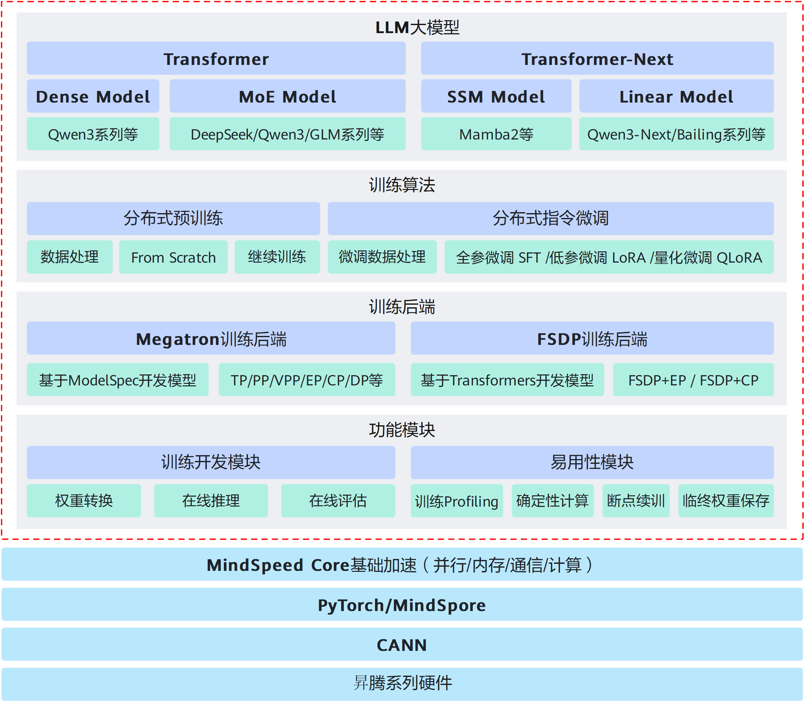

# 简介

## 概述

MindSpeed LLM，作为昇腾大模型训练框架，旨在为华为昇腾硬件提供端到端的大语言模型训练方案，包含分布式预训练、分布式指令微调以及对应的开发工具链。

MindSpeed LLM支持Transformer架构的大型语言模型（LLM，Large Language Model），并支持MoE模型的训练和调优。提供超过100个主流公版模型，以及开箱即用的模型训练脚本。

MindSpeed LLM是基于训练加速库MindSpeed的大语言模型分布式训练框架，原生对接MindSpeed Core训练加速库，从并行优化、内存优化、通信优化、计算优化四个方面，对基于昇腾硬件的大模型训练进行了极致优化。

## MindSpeed LLM架构

MindSpeed LLM架构关系如[图1](#架构图)所示，整体分为四个层次：

- **MindSpeed LLM功能模块**  
    MindSpeed LLM提供了完备的功能模块，包括：
    - Megatron <-> HuggingFace权重转换
    - 大模型分布式评估/推理
    - 性能分析Profiling数据采集、确定性计算
    - 训练断点续训、训练临终权重保存
- **MindSpeed LLM训练后端**  
    - **Megatron训练后端**：以Megatron-LM为基座，提供以ModelSpec为模板的模型增量开发方案，可以周级完成新模型的开发。
    - **FSDP2训练后端**：以MindSpeed-FSDP为基座，提供直接接入Transformers第三方库的模型增量开发方案，可以天级完成新模型的开发。
- **MindSpeed LLM训练算法**  
    - **分布式预训练**：支持端到端分布式预训练，包含数据处理与主流模型/数据切分方案。
    - **分布式指令微调**：支持多种业界主流的微调训练算法，来达成有竞争力的训练效果。
- **MindSpeed LLM大模型**  
    - **预制100+公版模型**：涵盖Dense/MoE/SSM主流系列模型，提供高性能模型训练脚本，开箱即用。
    - **兼容多种主流LLM架构**：支持基于Transformer/SSM架构的LLM模型。

**图 1**  MindSpeed LLM架构图  

## 功能特性

- 主流大语言模型：支持Qwen3/DeepSeek/Mamba2系列等100+主流LLM模型，涵盖Dense/MoE/SSM等LLM架构，提供针对昇腾架构的高性能训练脚本，开箱即用。

- 分布式预训练：支持分布式预训练，提供数据预处理方案与包含TP/PP/DP/CP/EP在内的多维并行策略。

- 分布式指令微调：支持业界主流的全参微调/LoRA/QLoRA微调训练算法，并提供微调性能/显存优化手段。

- 模型权重转换：支持Megatron/HuggingFace格式的权重转换和LoRA微调权重的独立/合并转换。

- 在线推理与评估：支持模型分布式在线推理与公版数据的在线评估。
