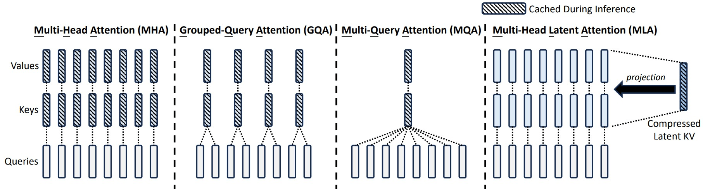
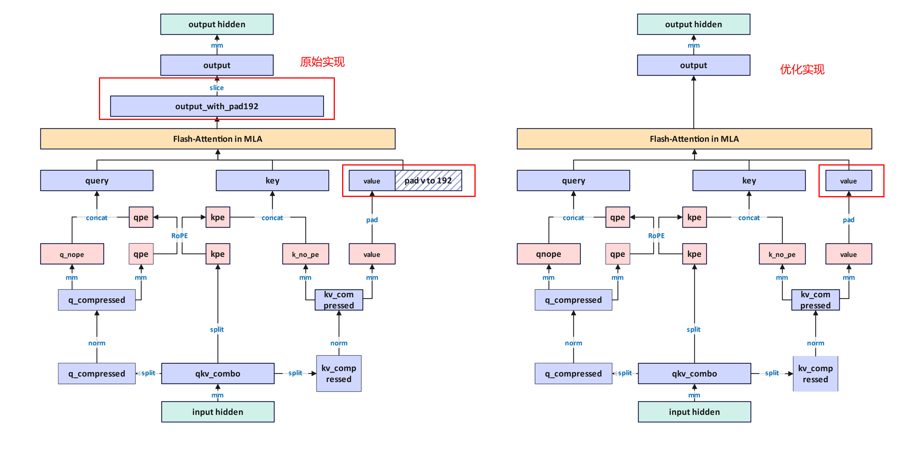
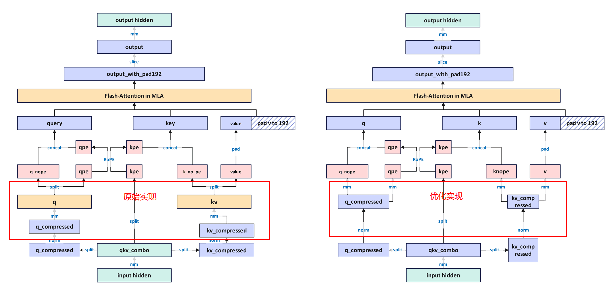

# Multi Latent Attention

## 使用场景

### 问题描述

DeepSeek系列模型创造性地提出多头潜在注意力：Multi-head Latent Attention(简称MLA），替代传统多头注意力(Multi Head Attention)。
具体而言，MLA利用低秩键值联合压缩(low-rank key-value joint compression)来降低推理时的KV Cache开销，并且模型效果不输于传统的MHA。

从MHA到MLA演化如图所示：

### 特性介绍

【--multi-latent-attention】

用于开启MLA特性，脚本里面使能该参数会将attention模块替换为MLA结构。

【--mla-fa-without-pad】

如上图所示：未开启该特性时，当query、key的维度和value的维度不匹配时，会将value维度padding到与query、key相同的维度，然后进入FA进行计算。开启该特性后，在进入FA之前不会进行pad处理，消减pad操作，减少额外显存占用，提升训练性能。

**建议CANN版本为8.2.RC1及更高版本使用，如遇到上图FA计算时shape不匹配报错，建议更新CANN包。**

【--mla-mm-split】

在对压缩后的q_compressed和kv_compressed进行升维，q_compressed经过升维后会转成q_no_pe和q_pos_emb，kv_compressed会转成k_no_pe和value，所以在进行升维操作时可以有两种方式，如下图所示：

- 开启--mla-mm-split后，与q_compressed相乘的矩阵会被初始化为两个(linear_qk_nope,linear_qk_rope)，q_compressed与这两个矩阵相乘直接得到q_no_pe和q_pos_emb；与kv_compressed相乘的矩阵会被初始化为两个(linear_kv_nope,linear_v)，kv_compressed与这两个矩阵相乘得到k_no_pe和value，会消减两次split操作，从而避免产生非连续tensor，优化转连续开销，但是由于对一个大矩阵乘拆分了两次，会降低矩阵乘的效率，同时TP通信多场景可能带来更多通信开销。
- 不使用--mla-mm-split，与q_compressed相乘的矩阵会被初始化一个(linear_q_up_proj)，q_compressed与这一个大矩阵相乘得到结果然后split成q_no_pe和q_pos_emb；与kv_compressed相乘的矩阵会被初始化为一个(linear_kv_up_proj)，kv_compressed与这个一个大矩阵相乘后split成k_no_pe和value。与开启--mla-mm-split相比，关闭该特性会提高矩阵计算效率，但是可能会有转连续的开销。

**推荐在无TP场景或者TP通讯量较少场景使用。**

【--enable-mla-absorb】

矩阵吸收（Matrix Absorption）是MLA中的优化技术，通过将上采样矩阵及输出投影矩阵合并，使得MLA中原本的MHA注意力机制变成MQA,从而减少显存开销。在MLA的注意力计算流程中，原本需要先通过上采样矩阵将低秩潜在表示恢复到完整维度，然后进行注意力计算，最后通过输出投影矩阵得到最终输出。矩阵吸收技术将q、k上采样矩阵，v上采样矩阵和输出投影矩阵预先合并，直接在低秩潜在空间进行注意力计算。

- 当前矩阵吸收功能需配合--use-sparse-flash-attn特性使用。

【--use-sparse-flash-attn】

使用稀疏注意力sparse_flash_attention，通过Lightning Indexer选择top-k最相关的token进行注意力计算，从而在保持模型效果的同时显著减少计算量。需要配合--enable-dsa-indexer使用。

【--mla-swap-core-attn-out】

在使能--multi-latent-attention特性时，开启--mla-swap-core-attn-out特性对core attention输出进行预存取，从而减少内存开销。

## 使用约束

【--multi-latent-attention】

如果使用MLA特性，需要在shell脚本里面指定支持MLA的spec。目前仓上支持MLA的spec有deepseek_spec、minicpm_spec，同时shell里面添加--multi-latent-attention特性。

【--mla-swap-core-attn-out】
如果使用--mla-swap-core-attn-out特性，需要同时使能--moe-fb-overlap和dualpipev特性。
