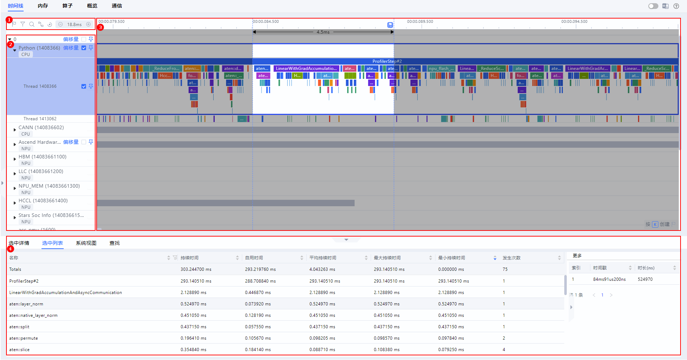
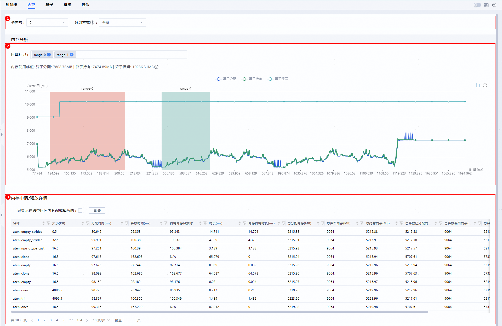

# 性能数据采集

## 概述

MindSpeed LLM支持基于昇腾芯片采集profiling数据，以提供对模型运行情况的分析。使用时只需将相关参数添加至训练脚本中，运行脚本即可进行采集。

## Mcore后端性能采集

### 推荐使用方法

这里给出两种配置示例，展示比较常用的使用场景：

- 初步简单分析性能时，可以只采集0号卡的CPU信息，查看通信和计算时间占比，各类算子占比以及算子调度信息，推荐配置如下：

    ```shell
    --profile                            # 打开profiling采集数据开关
    --profile-step-start  5              # 从第5步开始采集
    --profile-step-end 6                 # 到第6步结束，不包括第6步
    --profile-ranks 0                    # 采集0号卡的数据
    --profile-level level1               # 采集上层应用数据，底层NPU数据，NPU计算算子耗时和通信算子耗时信息，CANN层AscendCL数据信息，NPU AI Core性能指标信息，通信小算子耗时信息
    --profile-with-cpu                   # 采集CPU数据，用于分析通信和调度
    --profile-save-path ./profile_dir    # profiling数据采集保存路径
    ```

- 如果想要查看更详细的信息，如算子内存占用信息以及算子详细调用情况，可以加入`--profile-with-stack`、`--profile-with-memory`和`--profile-record-shapes`等参数，但是这会导致数据膨胀，性能劣化。具体配置如下：

    ```shell
    --profile                                       # 打开profiling采集数据开关
    --profile-step-start  5                         # 从第5步开始采集
    --profile-step-end 6                            # 到第6步结束，不包括第6步
    --profile-ranks 0                               # 采集0号卡的数据
    --profile-level level1                          # 采集上层应用数据，底层NPU数据，NPU计算算子耗时和通信算子耗时信息，CANN层AscendCL数据信息，NPU AI Core性能指标信息，通信小算子耗时信息
    --profile-with-cpu                              # 采集CPU数据，用于分析通信和调度
    --profile-with-stack                            # 采集指令运行堆栈信息
    --profile-with-memory                           # 采集算子内存信息
    --profile-record-shapes                         # 采集算子数据维度信息
    --profile-save-path ./profile_dir_with_stack    # profiling数据采集保存路径
    ```

### Mcore采集参数说明

| 参数 | 类型 | 默认值 | 说明 |
|------|------|--------|------|
| `--profile` | bool | `false` | 是否启用profiling |
| `--profile-step-start` | int | `0` | 指定开启采集数据的步骤（包含） |
| `--profile-step-end` | int | `-1` | 指定结束采集数据的步骤（不包含）；设置为-1时表示采集到训练结束 |
| `--profile-ranks` | List[int] | `[0]` | 指定采集数据的卡号，设置为-1时表示采集所有rank的profiling数据 |
| `--profile-level` | str | `level0` | 数据采集水平：<br>• `level0`：基础算子耗时<br>• `level1`：增加AICore利用率、通信算子（推荐）<br>• `level2`：更详细（含缓存、内存等） |
| `--profile-export-type` | str | `text` | 指定性能数据结果文件导出格式：<br>• `text`：文本格式 <br>• `db`：数据库格式 |
| `--profile-data-simplification` | bool | `false` | 是否启用数据精简模式（减小trace文件体积） |
| `--profile-with-cpu` | bool | `false` | 是否同时采集CPU活动（如数据加载、调度） |
| `--profile-with-stack` | bool | `false` | 是否采集指令运行堆栈（便于定位代码位置） |
| `--profile-with-memory` | bool | `false` | 是否采集NPU显存分配/释放事件（用于分析显存峰值、碎片化及内存泄漏）|
| `--profile-record-shapes` | bool | `false` | 是否采集计算shape（用于分析显存和计算量） |
| `--profile-save-path` | str | `./profile` | profiling数据采集保存路径（每个rank独立文件） |

## FSDP2后端性能采集

本工具基于 `torch_npu.profiler` 实现，集成于 MindSpeed FSDP2 训练流程。通过配置 YAML 或命令行参数，即可在指定训练步数和指定 rank 上自动采集性能数据，并生成 profiling 文件。

### 推荐使用方法  

这里给出两种配置示例，展示比较常用的使用场景。在训练配置文件（YAML）的 `training` 字段下添加 profiling 参数：

1. 初步分析性能时，可以只采集0号卡的CPU信息，查看通信和计算时间占比，各类算子占比以及算子调度信息，推荐配置如下：

    ```yaml
    training:
      # ... 其他训练参数 ...
    
      # --- Profiling: 初步性能分析 ---
      profile: true
      profile_step_start: 5
      profile_step_end: 6 # 采集[5, 6), 区间左闭右开
      profile_ranks: [0] # 只采集0号卡
      profile_level: level1
      profile_with_cpu: true
      profile_save_path: ./profile_dir
    ```

2. 如果想要进一步查看算子内存占用信息以及算子详细调用情况，可以加入 profile_with_stack、profile_with_memory 和profile_record_shapes 等参数，但是这会导致数据膨胀，性能劣化。具体配置如下:

    ```yaml
    training:
      # ... 其他训练参数 ...
    
      # --- Profiling: 深度分析（含堆栈/内存/shape）---
      profile: true
      profile_step_start: 5
      profile_step_end: 6 # 采集[5, 6), 区间左闭右开
      profile_ranks: [0] # 只采集0号卡
      profile_level: level1
      profile_with_cpu: true
      profile_with_stack: true # 采集算子详细调用情况
      profile_with_memory: true # 采集内存占用信息
      profile_record_shapes: true # 记录张量 shape
      profile_save_path: ./profile_dir_with_stack
    ```

### FSDP2采集参数说明

| 参数 | 类型 | 默认值 | 说明 |
|------|------|--------|------|
| `profile` | bool | `false` | 是否启用 profiling |
| `profile_step_start` | int | `0` | 开始采集的 global step（包含） |
| `profile_step_end` | int | `-1` | 结束采集的 global step（不包含）；`-1` 表示采集到训练结束 |
| `profile_ranks` | List[int] | `[-1]` | 要采集的 rank 列表；`[-1]` 表示所有 rank |
| `profile_level` | str | `level0` | 采集级别：<br>• `level_none`：关闭<br>• `level0`：基础算子耗时<br>• `level1`：增加 AICore 利用率、通信算子（推荐）<br>• `level2`：更详细（含缓存、内存等） |
| `profile_export_type` | str | `text` | 导出格式：<br>• `text`：文本格式 <br>• `db`：数据库格式 |
| `profile_data_simplification` | bool | `false` | 是否启用数据简化（减小 trace 文件体积） |
| `profile_with_cpu` | bool | `false` | 是否同时采集 CPU 活动（如数据加载、调度） |
| `profile_with_stack` | bool | `false` | 是否记录函数调用栈（便于定位代码位置） |
| `profile_with_memory` | bool | `false` | 是否采集 NPU 显存分配/释放事件，用于分析显存峰值、碎片化及内存泄漏|
| `profile_record_shapes` | bool | `false` | 是否记录张量 shape（用于分析显存和计算量） |
| `profile_save_path` | str | `./profile` | trace 文件保存目录（每个 rank 独立文件） |

## 输出文件

训练结束后，指定路径下将生成profiling文件，命名格式示例：

```shell
localhost.localdomain_3687609_20260129150104894_ascend_pt
```

该文件的目录结构如下：  

```shell
 localhost.localdomain_3687609_20260129150104894_ascend_pt
    ├─ASCEND_PROFILER_OUTPUT
    ├─logs
    └─PROF_000001_20260129150104896_KRPBOALLPQHOIAOA
        ├─device_0
        │  └─data
        ├─host
        │  └─data
        ├─mindstudio_profiler_log
        └─mindstudio_profiler_output
```

## 可视化性能分析

以MindStudio Insight工具为例，对采集到的profiling进行分析，请参考[MindStudio Insight工具部署文档](https://gitcode.com/Ascend/msinsight#%E7%8E%AF%E5%A2%83%E9%83%A8%E7%BD%B2)进行工具部署，然后将生成的profiling文件导入到工具中，进行性能的拆解分析。  
在这里我们简单介绍MindStudio Insight工具主要使用的几个界面：

- **时间线（Timeline）**

    时间线界面包含工具栏（区域一）、时间线树状图（区域二）、图形化窗格（区域三）和数据窗格（区域四）四个部分组成，如图界面所示。

    

- **内存（Memory）** 

    内存界面由参数配置栏（区域一）、算子内存折线图（区域二）、内存申请/释放详情表（区域三）三个部分组成，如图所示。

    

- **算子（Operator）**

    算子界面由参数配置栏（区域一）、耗时百分比饼状图（区域二）、耗时统计及详情数据表（区域三）三个部分组成，如图所示  

    

> [!NOTE]
>
> - 如果想要更多了解工具的使用方法，可以参考MindStudio Insight官方文档中的[MindStudio Insight系统调优](https://gitcode.com/Ascend/msinsight/blob/master/docs/zh/user_guide/system_tuning.md#%E5%9F%BA%E7%A1%80%E5%8A%9F%E8%83%BD)。
> - 如果您希望更加定制化的profiling采集方式，可参考[性能数据采集和自动解析](https://www.hiascend.com/document/detail/zh/canncommercial/82RC1/devaids/Profiling/atlasprofiling_16_0033.html)对采集代码进行修改，从而进行自定义采集和拆解分析。
