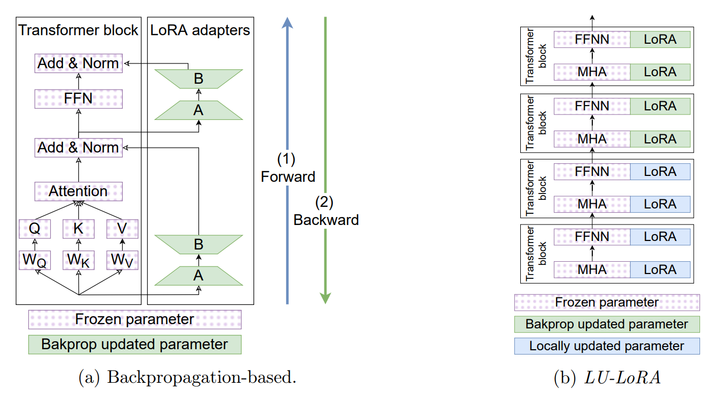

# LU-LoRA 微调介绍

局部更新的 LoRA（LU-LoRA）是一种新颖的参数高效微调（PEFT）方法，与全量微调和 PEFT 方法（如 LoRA）相比，它显著减少了内存占用并加速了微调时间。该方法有效地将局部学习规则与参数高效方法 LoRA 相结合。图 1a 展示了使用反向传播更新适配器的常规方法。LU-LoRA 提议在部分适配器中，用局部更新替代反向传播更新权重。整体方案如图 1b 所示。

## LU-LoRA 如何工作

该方法的主要组成部分包括：

1. 微调过程中基于反向传播和局部学习的有效结合，
2. 使用 Hebb 规则更新的 LoRA 适配器的特殊初始化，
3. LoRA 适配器的不同学习率。

*图 1：微调方案。*

## 使用说明

MindSpeed-LLM 支持在微调等任务中使用 LU-LoRA 进行混合低参数训练。使用方法是通过在基准任务中添加 LU-LoRA 参数来启用它。这里，我们以微调任务为例，说明如何在基准任务中使用 LU-LoRA。

### 数据预处理示例

MindSpeed-LLM 微调数据预处理脚本的命名和启动方法（其他基准任务的数据预处理，请参考相应任务的数据预处理文档）：

```shell
bash examples/mcore/llama2/data_convert_llama2_instruction.sh
```

在数据预处理过程中，如果 `output-prefix` 是 `./finetune_dataset/llama-2-7b/alpaca`，请使用以下命令：

```shell
python ./preprocess_data.py \
    --input ./dataset/train-00000-of-00001-a09b74b3ef9c3b56.parquet \
    --tokenizer-name-or-path ./model_from_hf/llama-2-7b-hf \
    --output-prefix ./finetune_dataset/llama-2-7b/alpaca \
    --workers 16 \
    --log-interval 1000 \
    --tokenizer-type PretrainedFromHF \
    --handler-name AlpacaStyleInstructionHandler \
    --prompt-type llama2
```

### hf2mcore 权重转换示例

MindSpeed-LLM LU-LoRA 微调脚本可以使用正常的 mcore 基础权重进行微调任务：

```shell
bash examples/mcore/llama2/ckpt_convert_llama2_hf2mcore.sh
```

在 hf2mcore 权重转换脚本中，使用以下命令：

```shell
# 权重格式转换，设置所需的并行配置，--num-layers-per-virtual-pipeline-stage 5，--params-dtype bf16 结合所需使用
python convert_ckpt.py \
 --model-type GPT \
 --load-model-type hf \
 --save-model-type mg \
 --target-tensor-parallel-size 8 \
 --target-pipeline-parallel-size 1 \
 --load-dir ./model_from_hf/llama-2-7b-hf/ \
 --save-dir ./model_weights/llama2-mcore/ \
 --tokenizer-model ./model_from_hf/llama-2-7b-hf/tokenizer.model \
 --use-mcore-models \
 --model-type-hf llama2
```

### LU-LoRA微调脚本部分描述

在使用相应命令进行微调时，`DATA_PATH`也应保持一致：

```shell
DATA_PATH="./finetune_dataset/llama-2-7b/alpaca" # 数据集路径
CKPT_LOAD_DIR="./model_weights/llama2-mcore/" # 权重路径
```

MindSpeed-LLM LU-LoRA微调脚本命名及启动方式：

```shell
# 初始化环境变量
source /usr/local/Ascend/cann/set_env.sh # 修改为实际安装的Toolkit包路径
source /usr/local/Ascend/nnal/atb/set_env.sh # 修改为实际安装的nnal包路径
# 启动任务
bash examples/mcore/llama2/tune_llama2_7b_lu_lora_ptd.sh
```

参数描述：

- **`--lu-lora-final-layer-index`** 
 使用LU-LoRA训练的最后一层的索引，例如，入参为11，表示模型的前12层（0层-11层）使用LU-LoRA算法，其余层使用LoRA算法。具有更多层的模型应更新更多层以进行局部学习，从而减少计算和内存消耗。然而，LU-LoRA覆盖的层数过多可能会限制模型的泛化能力。建议首先选择37.5%的层数以获得适当的内存消耗减少。进一步调整超参数可以进一步改善。
- **`--lu-lora-lr-ratio`** 
 LU-LoRA B与LU-LoRA A适配器的学习率比值，通常建议设置为24（默认），但根据特定模型的实验结果，可能会更小。
- **`--lu-lora-lr`** 
 LU-LoRA层的初始学习率，默认1.25e-6。LU-LoRA适配器的学习率可以与LoRA适配器的学习率不同。

### LU-LoRA权重与基础权重的合并与转换

在LU-LoRA微调后，获得的LU-LoRA权重与基础权重不同，不能直接用于推理或继续训练。它们需要与基础权重合并后才能使用。由于LU-LoRA基于LoRA，可以使用LoRA脚本。添加以下参数以将训练的LU-LoRA权重与基础权重合并，并在合并后将其转换为Mcore权重：

```shell
 --lora-load ${CHECKPOINT_LORA} \
 --lora-r 16 \
 --lora-alpha 32 \
 --lora-target-modules linear_qkv linear_proj linear_fc1 linear_fc2 \
```

以下是将Lora权重转换为Mcore权重的示例命令：

```shell
source /usr/local/Ascend/cann/set_env.sh # 修改为实际安装的Toolkit包路径

python convert_ckpt.py \
 --use-mcore-models \
 --model-type GPT \
 --load-model-type mg \
 --save-model-type mg \
 --load-dir ./model_weights/llama-2-7b-mcore \
 --lora-load ./ckpt/llama-7b-lora-mcore-tp1pp1 \
 --save-dir ./model_weights/llama2-7b-lora2mcore \
 --lora-r 16 \
 --lora-alpha 32 \
 --lora-target-modules linear_qkv linear_proj linear_fc1 linear_fc2 \
 --target-tensor-parallel-size 1 \
 --target-pipeline-parallel-size 1 \
 --model-type-hf llama2 
```

以下是与LoRA类似的启动转换脚本示例：

```shell
# 开始任务 
bash examples/mcore/llama2/ckpt_convert_llama2_mg2mg_lora.sh
```

#### 合并LU-LoRA权重并转换为Hugging Face权重

如果要合并LU-LoRA权重并将权重转换为Hugging Face (HF)格式，可以使用相同的LoRA命令：

```shell
source /usr/local/Ascend/cann/set_env.sh # 修改为实际安装的Toolkit包路径

python convert_ckpt.py \
    --model-type GPT \
    --use-mcore-models \
    --load-model-type mg \
    --save-model-type hf \
    --load-dir ./model_weights/llama-2-7b-mcore/ \
    --lora-load ./ckpt/llama-7b-lora-mcore-tp1pp1 \
    --lora-r 16 \
    --lora-alpha 32 \
    --lora-target-modules linear_qkv linear_proj linear_fc1 linear_fc2 \
    --target-tensor-parallel-size 1 \
    --target-pipeline-parallel-size 1 \
    --save-dir ./model_from_hf/llama-2-7b-hf/ #填写原HF模型路径，新的权重将存储在./model_from_hf/llama-2-7b-hf/mg2hg/
```

引导转换脚本示例如下：

```shell
#启动任务
bash examples/mcore/llama2/ckpt_convert_llama2_mcore2hf_lora.sh
```

**注意：**`lora`参数的值应该与微调时的参数设置保持一致，以保证转换后的模型具有相同的性能和兼容性。

### LU-LoRA推理

MindSpeed-LLM推理脚本命名及启动方法：

```shell
# 初始化环境变量
source /usr/local/Ascend/cann/set_env.sh # 修改为实际安装的Toolkit包路径
source /usr/local/Ascend/nnal/atb/set_env.sh # 修改为实际安装的nnal包路径
```

启动前需要根据实际情况修改启动脚本中的模型权重路径和tokenizer路径：

```shell
CHECKPOINT="./model_weights/llama-2-7b-mcore"
CHECKPOINT_LORA="./ckpt/llama-2-7b-lora/"
TOKENIZER_PATH="./model_from_hf/llama-2-7b-hf/"

#启动任务
bash examples/mcore/llama2/generate_llama2_7b_lora_ptd.sh
```

### LU-LoRA微调权重评估

使用LU-LoRA微调权重的专用评估脚本与LoRA相同。

## 引用

- [Going beyond classical LLM LoRA fine-tuning with Hebb learning: blazingly fast and accurate (European Conference on Artificial Intelligence (accepted), 2025)](https://ecai2025.org/accepted-papers/)
- [Implementation Challenges and Strategies for Hebbian Learning in Convolutional Neural Networks (Optical Memory and Neural Networks Journal, 2023)](https://dl.acm.org/doi/abs/10.3103/S1060992X23060048)
