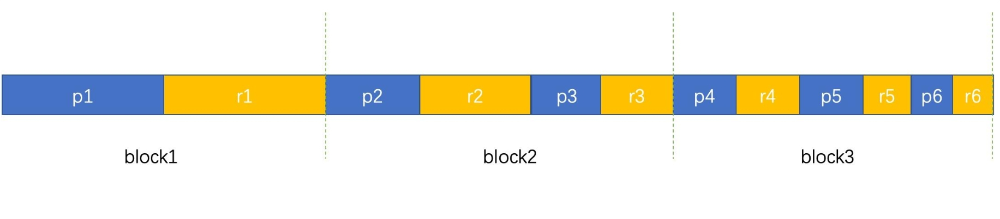

# 多样本Pack微调

## 使用场景

由于计算资源紧缺，训练过程中加载的每个批次的样本长度不一。大部分的数据都需要在结尾padding到 `seq-length` 的长度，这导致训练效率低，造成计算资源浪费。多样本Pack将多个样本（如文本序列）打包成一个“Pack”，会将指定数据集中，不同长度的数据组合成指定长度，并尽可能地填充有效的数据内容。若拼接的数据无法达到指定的 `seq-length` 的长度，则该数据将会被Pad到指定的长度。因此，**每条Pack数据集的长度都一致**，从而减少训练过程中的样本数量，提高训练效率。

如图所示，新样本是由多个初始样本合并而成，每个block是一个新的样本：



微调数据每个样本的组成是一个problem(p)对应一个response(r)，即一问一答相对应，写做p1r1、p2r2等。

参与计算式的`attn_mask` 也改变成锯齿状的矩阵类型：


在非Pack场景下，矩阵是完整下三角矩阵，多个样本之间的self-attention没有掩盖，所有token均参与计算，而Pack场景下数据为锯齿状白色三角，其余区域为mask，样本之间保持独立，不能互相作self-attention，减少了微调数据的处理量，同时可以保持样本之间的独立性，提升训练效率。

业界还有其他Pack模式（下三角Pack等），敬请期待支持。

## 使用说明

本章节以[Qwen3-32B Pack微调脚本](../../../../../../examples/mcore/qwen3/tune_qwen3_32b_32K_full_pack_A3_ptd.sh)使用Alpaca数据集微调为例，介绍多样本Pack微调方法，**更多模型支持Pack模式，请参考example目录使用**。

多样本Pack微调主要包含以下流程：

1. 环境搭建  
    启动微调前请参考[MindSpeed LLM安装指导](../../../training/install_guide.md)完成环境安装，并确保已完成昇腾NPU套件相关的环境变量配置，如下所示：

    ```shell
    source /usr/local/Ascend/cann/set_env.sh     # 修改为实际安装的Toolkit包路径
    source /usr/local/Ascend/nnal/atb/set_env.sh # 修改为实际安装的nnal包路径
    ```

2. 配置指令微调脚本  
    详细的参数配置请参考[Qwen3-32B Pack微调脚本](../../../../../../examples/mcore/qwen3/tune_qwen3_32b_32K_full_pack_A3_ptd.sh)。

    需要在脚本中修改相关路径参数：

    ```shell
    CKPT_LOAD_DIR="your model ckpt path"        # HuggingFace权重路径
    CKPT_SAVE_DIR="your model save ckpt path"   # 指向用户指定的微调后权重保存路径（例如指定保存到`ckpt`文件夹下）
    DATA_PATH="your data path"                  # 原始数据集路径
    TOKENIZER_PATH="your tokenizer path"        # 指定模型的分词器路径（例如`tokenizer.model`）
    ```

    微调相关参数说明：

    - `--is-instruction-dataset`：用于指定微调过程中采用指令微调数据集，以确保模型依据特定指令数据进行微调。
    - `--prompt-type`：用于指定模型模板，能够让base模型微调后能具备更好的对话能力。`prompt-type`的可选项可以在[templates.json](../../../../../../configs/finetune/templates.json)文件内查看。
    - `--reset-attention-mask`：启用该参数时，将根据EOD计算句子的分隔位置，生成`actual_seq_len`，并将其传入FA算子，实现类似锯齿状的mask计算效果，FA算子随后进行TND格式的计算。
    - `--neat-pack`：是Pack场景下使用锯齿状的`attention_mask`参与计算的开关，其作用是利用数据集处理阶段生成的`attention_mask`生成对应的`actual_seq_len`。
    - `--padded-samples` 【可选参数】：将样本总数凑成`batch-size`的整数倍。
    - `--no-shuffle`【可选参数】：数据顺序加载。

3. 启动微调  
    微调脚本配置完毕后，可运行脚本启动微调：

    ```shell
    bash eexamples/mcore/qwen3/tune_qwen3_32b_32K_full_pack_A3_ptd.sh
    ```

> [!NOTE]
> [Qwen3-32B Pack微调脚本](../../../../../../examples/mcore/qwen3/tune_qwen3_32b_32K_full_pack_A3_ptd.sh)支持数据/权重在线加载训练，即集成了数据预处理、权重转换和训练于一体，单脚本即可启动训练任务。若需该功能更多详情可参见[数据/权重在线加载训练](../../pretrain/mcore/train_from_hf.md)。
> 
> - 权重转换合一训练：实现HuggingFace权重到Megatron格式的双向自动转换与训练合一，用户无需单独执行权重转换步骤，实现从HuggingFace权重到训练任务的一键式集成。
> - 自动转换原始数据：数据预处理功能在模型训练时自动识别并转换原始数据文件，无需用户手动执行原始数据转换。系统将根据输入路径自动判断是否为原始数据格式（如`.jsonl`、`.parquet`等），并在训练初始化阶段自动完成数据格式转换。

## 使用约束

- 数据预处理时，使用 `--neat-pack` 参数的前提是必须使用 `--pack` 参数。

- 微调时，使用 `--neat-pack` 参数的前提是必须使用 `--reset-attention-mask` 参数。

- 当前微调数据预处理使用的默认模板已和LLaMA Factory 0.8.2对齐，如果需要与该版本之后的版本对齐，请在微调数据预处理阶段设置`prompt-type`参数值为`qwen_lf`。
