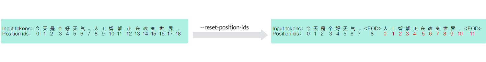

# 大模型分布式预训练Pack模式

## 使用场景

在大模型的预训练任务中，一个训练批次中的输入序列通常由多个文档拼接而成。默认情况下，模型会将这些文档视为一个连续的序列，不会对它们之间的self-attention进行遮蔽，这意味着不同文档之间可以相互建立上下文依赖。

然而，在某些特定场景下，不同文档之间需要相互独立，不能共享上下文信息。例如，当文档之间存在语义不相关性或需要保持训练目标隔离时，必须禁止它们之间的 self-attention。此时，模型需要在每个文档的结束位置（EOD）处，重新设置attention mask和position ids，以实现文档级别的注意力隔离。为提升token的利用率，预训练过程中可以采用pack技术，即将多个较短的样本拼接成一个完整的训练序列。在此过程中，模型无法自动识别不同样本的边界，因此需要在每条样本末尾显式插入EOD token，以标识边界并指导后续的attention mask构建。要启用该功能，用户只需在数据预处理和训练脚本中设置相应参数，即可实现高效且语义明确的预训练过程。

## 使用说明

大模型分布式预训练pack模式主要包含以下流程：  

**图 1**  预训练流程图  


1. 环境搭建  
    启动预训练前请参考[MindSpeed LLM安装指导](../../install_guide.md)完成环境安装，并确保已完成昇腾NPU套件相关的环境变量配置，如下所示：

    ```shell
    source /usr/local/Ascend/cann/set_env.sh # 修改为实际安装的Toolkit包路径
    source /usr/local/Ascend/nnal/atb/set_env.sh # 修改为实际安装的nnal包路径
    ```

2. 预训练数据预处理  
    首先，准备好原始数据集，常见的预训练数据集有：
    - [Alpaca数据集](https://huggingface.co/datasets/tatsu-lab/alpaca)
    - [Enwiki数据集](https://huggingface.co/datasets/lsb/enwiki20230101)
    - [C4数据集](https://huggingface.co/datasets/allenai/c4)
    - [ChineseWebText](https://huggingface.co/datasets/CASIA-LM/ChineseWebText)

    然后，以[Enwiki数据集](https://huggingface.co/datasets/lsb/enwiki20230101)为例执行数据预处理，详细的脚本配置可参考[Qwen3预训练数据处理脚本](../../../../../../examples/mcore/qwen3/data_convert_qwen3_pretrain.sh)，需要修改脚本中的以下内容：

    ```bash
    source /usr/local/Ascend/cann/set_env.sh # 修改为实际安装的Toolkit包路径

    ......
    --input ./dataset/train-00000-of-00042-d964455e17e96d5a.parquet # 原始数据集路径 
    --tokenizer-name-or-path ./model_from_hf/qwen3_hf # HF的tokenizer路径
    --output-prefix ./finetune_dataset/enwiki  # 保存路径
    --append-eod  # 添加此参数开启pack模式数据预处理
    ......
    ```

    数据预处理相关参数说明:

    - `input`：可以直接输入到数据集目录或具体文件，如果是目录，则处理全部文件, 支持`.parquet`，`.csv`，`.json`，`.jsonl`，`.txt`，`.arrow`格式， 同一个文件夹下的数据格式需要保持一致。
    - `handler-name`：当前预训练默认使用 `GeneralPretrainHandler`，支持的是预训练数据风格，提取数据的`text`列，格式如下：

        ```shell
        [
            {"text": "document"},
            {"other keys": "optional content"}
        ]
        ```

    - `json-keys`：从文件中提取的列名列表，默认为 `text`，可以为 `text`, `input`, `title` 等多个输入，结合具体需求及数据集内容使用，如：

        ```shell
        --json-keys text input output
        ```

    - `n-subs`：数据预处理并行加速参数。当需要预处理的数据集比较大时，可以通过并行处理进行加速，方法为设置参数`--n-subs`，通过该参数设置并行处理数量。在数据预处理过程会将原始数据集切分为`n-subs`个子集，对子集进行并行处理，然后合并，从而实现加速。建议预处理数据集超过GB级别时加上该参数。
    - `append-eod`：该参数的作用是将文档结束标记`EOD`显式地添加到每条数据的末尾，防止模型学习无意义的关联。该参数使能后的效果如下：  
    

    最后，相关参数设置完毕后，运行数据预处理脚本：

    ```shell
    bash examples/mcore/qwen3/data_convert_qwen3_pretrain.sh
    ```

3. 配置单机或多机预训练脚本  
    详细的参数配置请参考[Qwen3-8B预训练脚本](../../../../../../examples/mcore/qwen3/pretrain_qwen3_8b_4K_ptd.sh)。脚本中的环境变量配置见[环境变量说明](../../../features/mcore/environment_variable.md)。

    环境变量确认无误后，需要在脚本中修改节点相关配置，单机和多机配置如下：

    - 单机配置

        ```shell
        NPUS_PER_NODE=8 # 单节点的卡数
        MASTER_ADDR=localhost
        MASTER_PORT=6000
        NNODES=1  
        NODE_RANK=0  
        WORLD_SIZE=$(($NPUS_PER_NODE * $NNODES))
        ```

    - 多机配置

        ```shell
        # 根据分布式集群实际情况配置分布式参数
        NPUS_PER_NODE=8  # 每个节点的卡数
        MASTER_ADDR="your master node IP"  # 都需要修改为主节点的IP地址（不能为localhost）
        MASTER_PORT=6000
        NNODES=2  # 集群里的节点数，以实际情况填写
        NODE_RANK="current node id"  # 当前节点的RANK，多个节点不能重复，主节点为0, 其他节点可以是1、2...
        WORLD_SIZE=$(($NPUS_PER_NODE * $NNODES))
        ```

    然后需要在脚本中修改相关路径参数和模型切分配置：

    ```shell
    CKPT_SAVE_DIR="your model save ckpt path" # 训练完成后的权重保存路径
    DATA_PATH="your data path" # 数据集路径，填入数据预处理时保存的数据路径
    TOKENIZER_PATH="your tokenizer path" # 词表路径，填入下载的开源权重词表路径
    CKPT_LOAD_DIR="your model ckpt path" # 权重加载路径，填入权重转换时保存的权重路径

    TP=1 # 模型权重转换的tp大小，在本例中是1
    PP=4 # 模型权重转换的pp大小，在本例中是4
    ```

    以上通用配置完成后，要开启Pack模式训练，需要在[Qwen3-8B预训练脚本](../../../../../../examples/mcore/qwen3/pretrain_qwen3_8b_4K_ptd.sh)基础上，加上`--reset-attention-mask`参数。该参数开启时，会按照EOD计算句子的分隔位置，生成actual_seq_len，传入FA算子中相当于锯齿状的mask计算效果。该参数的使能效果如下图所示：
    

    另外，使用`--attention-mask-type`需要注意：默认是causal，支持causal和general格式。
    1. `--attention-mask-type`是general，attention-mask会从数据获取生成。
    2. `--attention-mask-type`是causal，attention-mask会在FA前生成压缩固定长度(2048)的mask，性能和显存会比方案1更好，推荐使用。

    可选功能：`--reset-position-ids`参数，在开启EOD功能之后，每条数据由不同的样本拼接而成，因此其位置ID并不连续。该参数用于将数据的position-ids按照EOD结尾生成ids，而非连续的ids。模型将在每个EOD之后，对position-ids从0开始重新编号，从而隔离不同句子间的位置计算，作用于attention中query和key的位置编码。

    脚本内的其他相关参数说明:

    - `DATA_PATH`：数据集路径。请注意实际数据预处理生成文件末尾会增加`_text_document`，该参数填写到数据集的文件前缀即可。例如实际的数据集相对路径是`./finetune_dataset/alpaca/alpaca_text_document.bin`等，那么只需填写`./finetune_dataset/alpaca/alpaca_text_document`即可。
    - `CKPT_LOAD_DIR`: 权重加载路径。预训练时可以选择随机初始化模型权重，此时该参数不用配置，同时需要注释掉预训练脚本中的`--load ${CKPT_LOAD_DIR} \`代码行。
    - `tokenizer-type`：参数值为PretrainedFromHF时， 词表路径仅需要填到模型文件夹即可，不需要到tokenizer.model文件；参数值不为PretrainedFromHF时，例如Qwen3Tokenizer，需要指定到tokenizer.model文件。示例如下：

        ```bash 
        # tokenizer-type为PretrainedFromHF
        TOKENIZER_PATH="./model_from_hf/Qwen3-8B/"
        --tokenizer-name-or-path ${TOKENIZER_PATH}

        # tokenizer-type不为PretrainedFromHF
        TOKENIZER_MODEL="./model_from_hf/Qwen3-8B/tokenizer.model"
        --tokenizer-model ${TOKENIZER_MODEL}
        ```
    
    > [!NOTE]
    > - 提供的路径需要加双引号。
    > - 多机训练中请确保每台机器上的模型路径和数据集路径等无误，如果没有设置数据共享，需要在训练启动脚本中增加`no-shared-storage`参数。设置此参数之后将会根据布式参数判断非主节点是否需要load数据，并检查相应缓存和生成数据。

4. 启动预训练  
    预训练脚本配置完毕后，可运行脚本启动预训练（多机场景中需要在多个终端上同时启动脚本）：

    ```shell
    bash examples/mcore/qwen3/pretrain_qwen3_8b_4K_ptd.sh
    ```

## 使用约束

数据预处理阶段的`append-eod`参数需要和预训练阶段的`reset-attention-mask`参数搭配一起使用：

- 如果只开`append-eod`的话，文档末尾添加了 `<EOD>`，FA计算缺失了文档的长度信息，计算FA的时候按照跨文档计算，模型仍学习的是跨文档的信息。
- 如果只开`reset-attention-mask`，FA计算虽然统计了文档的长度信息，但由于数据缺失`<EOD>`分割，导致统计的文档还是按照跨文档计算，模型仍学习的是跨文档的信息。
- 如果数据预处理开启`append-eod`且预训练开启`reset-attention-mask`，FA计算可以统计每个有`<EOD>`分割的文档长度，FA计算是对每个文档进行独立计算，模型学习到的是非跨文档信息。
